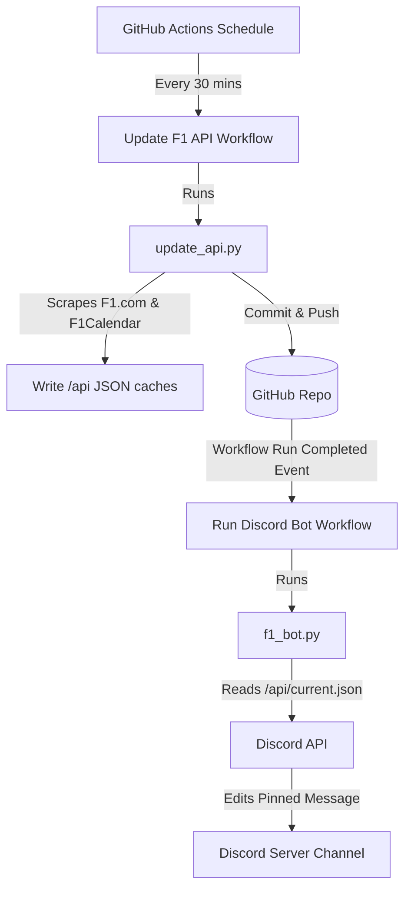

# 🏎️ Serverless F1 Discord Bot & API Scraper

An automated, serverless Discord bot that keeps a channel updated with Formula 1 grand prix schedules and results. It scrapes information directly from the official F1 website and F1Calendar, processes it into standard Ergast-compatible JSON caches, and posts dynamic updates on Discord.

---

## 📌 Features

- **Automated Web Scraper**: Periodically gathers data from official Formula 1 pages:
  - Driver Standings 🏆 (`api/standings.json`)
  - Race Results / Podiums 🏁 (`api/results.json`)
  - Qualifying Results ⏱️ (`api/qualifying.json`)
  - Multi-session Race Calendars 📅 (`api/current.json`)
- **Serverless Discord Bot**: Automatically posts and updates a pinned Discord message with the schedule for the next Grand Prix, including Practice, Sprint, Qualifying, and Race times dynamically converted to Unix timestamps (rendered in local user timezones on Discord).
- **Chained CI/CD Pipeline**: Orchestrated using GitHub Actions. The scraper runs on a schedule or push, commits updated F1 data to the repository, and then triggers the Discord bot automatically to keep the channel up-to-date.

---

## 🛠️ System Architecture



---

## ⚙️ Setup & Installation

### Prerequisite Environment Variables
Create a `.env` file in the root of the project:
```env
DISCORD_TOKEN=your_discord_bot_token_here
```

### Local Setup
1. **Clone the repository** and enter the folder:
   ```bash
   git clone <your-repo-url>
   cd f1-bot
   ```

2. **Create a virtual environment**:
   ```bash
   python3 -m venv .venv
   source .venv/bin/activate  # On Windows: .venv\Scripts\activate
   ```

3. **Install dependencies**:
   ```bash
   pip install -r requirements.txt
   ```

---

## 🚀 Running Locally

### 1. Update the Local API Data (Scraper)
To scrape the latest standings, results, and calendars and cache them locally in the `api/` directory:
```bash
python update_api.py
```

### 2. Run the Discord Bot
Once your local `api/` cache is populated and your `.env` contains a valid Discord bot token:
```bash
python f1_bot.py
```
*Note: The bot runs as a one-shot task, checking for existing bot messages in the channel to update, or posting a new message if none exist, before shutting down cleanly.*

---

## 🤖 GitHub Actions Workflow Orchestration

The project uses two workflows under `.github/workflows/`:

1. **`Update F1 API` (`update_api.yml`)**:
   - Runs every 30 minutes, on manual trigger (`workflow_dispatch`), or on pushes to `main` (ignoring changes under `api/**`).
   - Installs packages, runs `update_api.py`, and commits changes to the repository using `github-actions[bot]`.
2. **`Run Serverless F1 Discord Bot` (`run_bot.yml`)**:
   - Runs automatically after the `Update F1 API` workflow finishes successfully.
   - Signs into Discord, reads the checked-out `api/current.json`, and updates the channel status.
